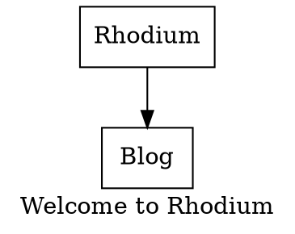
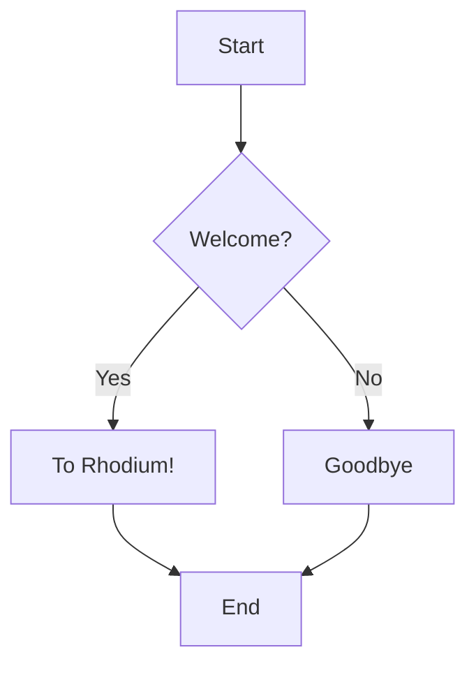

Lorem ipsum dolor sit amet, consectetur adipiscing elit, sed do eiusmod tempor incididunt ut labore et dolore magna aliqua. Ut enim ad minim veniam, quis nostrud exercitation ullamco laboris nisi ut aliquip ex ea commodo consequat. Duis aute irure dolor in reprehenderit in voluptate velit esse cillum dolore eu fugiat nulla pariatur. Excepteur sint occaecat cupidatat non proident, sunt in culpa qui officia deserunt mollit anim id est laborum. Lorem ipsum dolor sit amet, consectetur adipiscing elit, sed do eiusmod tempor incididunt ut labore et dolore magna aliqua. Ut enim ad minim veniam, quis nostrud exercitation ullamco laboris nisi ut aliquip ex ea commodo consequat. Duis aute irure dolor in reprehenderit in voluptate velit esse cillum dolore eu fugiat nulla pariatur. Excepteur sint occaecat cupidatat non proident, sunt in culpa qui officia deserunt mollit anim id est laborum.

## Heading 2

### Heading 3

#### Heading 4

##### Heading 5

## Text Formatting ⟨ Basic Styles ⟩

This is _italic text_ and _also italic_.
This is **bold text** and **also bold**.
This is **_bold italic_** and **_also bold italic_**.
This is ~~strikethrough text~~.
This is `inline code` with backticks.
This is <mark>highlighted text</mark> using HTML.
This is <sub>subscript</sub> and <sup>superscript</sup> text.
Combining styles: **bold with _italic inside_ and `code`** and ~~strikethrough with **bold**~~.

## Line Breaks and Paragraphs ⊡

Single line break  
with two spaces at the end.
Double line break creates a new paragraph.
Hard break using backslash\\
at the end of line.

## Horizontal Rules ⟷

Three or more hyphens:
Three or more asterisks:

---

## Three or more underscores:

## Blockquotes ⟪ ⟫

> Single level blockquote with simple text.
> Blockquote with **bold**, _italic_, and `code`.
>
> Multiple paragraphs in blockquote.
> Nested blockquotes
>
> > Level 2 quote
> >
> > > Level 3 quote with `code`
> > >
> > > > Level 4 quote
> > > > Blockquote with list:
>
> - Item 1
> - Item 2
>   - Nested item
>
> 1. Numbered item
> 2. Another item

## Lists ⊙ All Variations

### Unordered Lists ◈

- First item
- Second item
  - Nested item 2.1
  - Nested item 2.2
    - Deep nested 2.2.1
    - Deep nested 2.2.2
- Third item

* Using asterisks
* Another item
  - Nested with asterisk

- Using plus signs
- Another plus item
  - Nested plus

### Ordered Lists ◉

1. First item
2. Second item
   1. Nested item 2.1
   2. Nested item 2.2
      1. Deep nested 2.2.1
      2. Deep nested 2.2.2
3. Third item with `code`

1) Using parentheses
2) Another style
   a) Letter nested
   b) Another letter

### Mixed Lists ⟐

1. Ordered item
   - Unordered nested
   - Another unordered
     1. Back to ordered
     2. Another ordered
2. Second ordered item
   - Different marker
   * Yet another marker

### Task Lists ☐ ☑

- [x] Completed task
- [ ] Uncompleted task
- [x] ~~Completed with strikethrough~~
  - [x] Nested completed
  - [ ] Nested uncompleted
    - [ ] Deep nested task

### Definition Lists ≡

Term 1
: Definition 1 for term 1
: Alternative definition for term 1
Complex Term
: Definition with **bold** and _italic_
: Another definition with `code`
Nested Definition
: Primary definition
: Nested definition part
: Another nested part

## Links ⟶ All Types

### Basic Links ⤳

[Basic link](https://example.com)
[Link with title](https://example.com \"This is a title\")
<https://autolink.com>
<email@example.com>

### Reference Links ⟳

[Reference link][ref1]
[Another reference][ref2] with text.
[ref1]: https://example.com \"Reference 1\"
[ref2]: https://example.com/page2 \"Reference 2\"

### Internal Links ⤺

[Link to heading](#heading-1--top-level)
[Link with `code` in text](https://example.com)

## Images ⬚ All Formats

### Basic Images ▦


### Images with Links ▨

[](https://example.com)

## Tables - Tabular Data



## Tables - Complex Examples

### Basic Table ⋮

| Header 1 | Header 2 | Header 3 |
| -------- | -------- | -------- |
| Cell 1   | Cell 2   | Cell 3   |
| Cell 4   | Cell 5   | Cell 6   |

### Aligned Table ⟺

| Left Aligned | Center Aligned | Right Aligned |
| :----------- | :------------: | ------------: |
| Left         |     Center     |         Right |
| **Bold**     |    _Italic_    |        `Code` |

### Complex Table with Various Content ⊠

| Feature    | Description                         | Code Example         | Status |
| :--------- | :---------------------------------- | :------------------- | :----: |
| **Lists**  | • Bullet 1<br>• Bullet 2            | `- Item`<br>`* Item` |   ✓    |
| _Math_     | Inline: $a^2 + b^2$                 | `$equation$`         |   ✓    |
| ~~Strike~~ | Strikethrough text                  | `~~text~~`           |   ✓    |
| [Links](#) | Clickable references                | `[text](url)`        |   ✓    |
| Images     |  | ``           |   ✓    |

### Nested Content in Tables ⧈

| Type       | Example       | LaTeX                   |
| :--------- | :------------ | :---------------------- |
| Set Theory | ∈ ∉ ⊂ ⊃ ⊆ ⊇   | $x \\in A$              |
| Logic      | ∀ ∃ ∧ ∨ ¬ ⇒ ⇔ | $\\forall x \\exists y$ |
| Operators  | ∑ ∏ ∫ ∮ ∂ ∇   | $\\sum_{i=1}^n x_i$     |

### Large Table

| Challenge                 | ClickHouse Native Limitation                            | GlassFlow + ClickStack Solution                                     | Column A        | Column B      | Column C        | Column D      |
| ------------------------- | ------------------------------------------------------- | ------------------------------------------------------------------- | --------------- | ------------- | --------------- | ------------- |
| Data Deduplication        | ReplacingMergeTree is eventual; FINAL is slow.          | Upstream, stateful deduplication ensures clean data upon ingestion. | Alpha Sequence  | Lunar Metrics | Static Override | Crimson Path  |
| Schema Evolution          | Requires manual ALTER TABLE; can break the pipeline.    | Automated schema detection and column creation in the sink.         | Echo Protocol   | Binary Shard  | Glass Index     | Temporal Code |
| Real-time Data Enrichment | Query-time JOIN operations are expensive on large data. | Pre-ingestion temporal joins create flat, fast-to-query tables.     | Phantom Trigger | Velvet Ratio  | Carbon Filter   | Spiral Thread |
| Data Quality              | Inconsistent or invalid data can pollute the database.  | Upstream filtering and transformation acts as a quality gate.       | Hollow Matrix   | Quartz Beacon | Delta Gateway   | Obsidian Key  |

## Code Blocks ⌨ All Languages

### Inline Code Variations

Regular inline: `code`
Inline with backticks: `` `backticks` ``
Inline with more backticks: ` ``double backticks`` `

### ActionScript

```actionscript
// rhodium.as
// This is a test for ActionScript syntax highlighting.
package {
    import flash.display.Sprite;
    import flash.text.TextField;
    public class Rhodium extends Sprite {
        public function Rhodium() {
            var message:TextField = new TextField();
            message.text = "Welcome to Rhodium";
            addChild(message);
        }
    }
}
```

### Ada

```ada
-- rhodium.adb
-- This is a test for Ada syntax highlighting.
with Ada.Text_IO; use Ada.Text_IO;
procedure Rhodium is
begin
   Put_Line(\"Welcome to Rhodium\");
end Rhodium;
```

### Agda

```agda
-- rhodium.agda
-- This is a test for Agda syntax highlighting.
module Rhodium where
open import Data.String
message : String
message = \"Welcome to Rhodium\"
```

### Angular

```js
// rhodium.component.ts
// This is a test for Angular syntax highlighting.
import { Component } from "@angular/core";
@Component({
  selector: "app-rhodium",
  template: "<h1>Welcome to Rhodium</h1>",
})
export class RhodiumComponent {}
```

### AppleScript

```applescript
Generated applescript
-- rhodium.applescript
-- This is a test for AppleScript syntax highlighting.
display dialog "Welcome to Rhodium"
```

### Assembly

```armasm
; rhodium.asm
; This is a test for Assembly syntax highlighting.
section .data
    msg db 'Welcome to Rhodium',0xa
    len equ $ - msg
section .text
    global _start
_start:
    ; Write message to stdout
    mov eax, 4
    mov ebx, 1
    mov ecx, msg
    mov edx, len
    int 0x80
```

### Astro

```js
---
// rhodium.astro
// This is a test for Astro syntax highlighting.
const message = \"Welcome to Rhodium\";
---
<html>
  <body>
    <h1>{message}</h1>
  </body>
</html>
```

### C

```c
// rhodium.c
// This is a test for C syntax highlighting.
#include <stdio.h>
int main() {
    printf(\"Welcome to Rhodium\
\");
    return 0;
}
```

### Clojure

```clojure
;; rhodium.clj
;; This is a test for Clojure syntax highlighting.
(ns rhodium.core)
(defn greet []
  (println \"Welcome to Rhodium\"))
(greet)
```

### COBOL

```cobol
      * rhodium.cob
      * This is a test for COBOL syntax highlighting.
       IDENTIFICATION DIVISION.
       PROGRAM-ID. RHODIUM.
       PROCEDURE DIVISION.
           DISPLAY \"Welcome to Rhodium\".
           STOP RUN.
```

> NOTE: Not working

### Config

```config
# rhodium.conf
# This is a test for configuration file syntax.
[rhodium]
message = \"Welcome to Rhodium\"
enabled = true
port = 8080
```

### Dockerfile

```dockerfile
# rhodium.dockerfile
# This is a test for container configuration syntax.
FROM alpine:latest
RUN echo \"Welcome to Rhodium\"
CMD [\"echo\", \"Container started\"]
```

### Coq

```coq
(* rhodium.v *)
(* This is a test for Coq syntax highlighting. *)
Require Import String.
Definition message := \"Welcome to Rhodium\"%string.
Compute message.
```

### C++

```cpp
// rhodium.cpp
// This is a test for C++ syntax highlighting.
#include <iostream>
#include <string>
int main() {
    std::string message = \"Welcome to Rhodium\";
    std::cout << message << std::endl;
    return 0;
}
```

### Crystal

```crystal
# rhodium.cr
# This is a test for Crystal syntax highlighting.
message = \"Welcome to Rhodium\"
puts message
```

### C#

```csharp
// rhodium.cs
// This is a test for C# syntax highlighting.
using System;
namespace Rhodium
{
    class Program
    {
        static void Main()
        {
            Console.WriteLine(\"Welcome to Rhodium\");
        }
    }
}
```

### CSS

```css
/* rhodium.css */
/* This is a test for CSS syntax highlighting. */
:root {
  --rhodium-bg: #090e13;
  --rhodium-fg: #c5c9c7;
}
.rhodium-welcome {
  color: var(--rhodium-fg);
  background: var(--rhodium-bg);
  content: \"Welcome to Rhodium\";
}
```

### D

```d
// rhodium.d
// This is a test for D syntax highlighting.
import std.stdio;
void main() {
    writeln(\"Welcome to Rhodium\");
}
```

### Dart

```dart
// rhodium.dart
// This is a test for Dart syntax highlighting.
void main() {
  String message = \"Welcome to Rhodium\";
  print(message);
}
```

### Elixir

```elixir
# rhodium.ex
# This is a test for Elixir syntax highlighting.
defmodule Rhodium do
  def greet do
    IO.puts(\"Welcome to Rhodium\")
  end
end
Rhodium.greet()
```

### Elm

```elm
-- rhodium.elm
-- This is a test for Elm syntax highlighting.
module Rhodium exposing (main)
import Html exposing (text)
main =
    text \"Welcome to Rhodium\"
```

### Erlang

```erlang
% rhodium.erl
% This is a test for Erlang syntax highlighting.
-module(rhodium).
-export([greet/0]).
greet() ->
    io:format(\"Welcome to Rhodium~n\").
```

### Fennel

```fennel
;; rhodium.fnl
;; This is a test for Fennel syntax highlighting.
(local message \"Welcome to Rhodium\")
(print message)
```

### Fortran

```fortran
! rhodium.f90
! This is a test for Fortran syntax highlighting.
program rhodium
    implicit none
    print *, \"Welcome to Rhodium\"
end program rhodium
```

### GAP

```gap
# rhodium.gap
# This is a test for GAP syntax highlighting.
message := \"Welcome to Rhodium\";
Print(message, \"\
\");
```

### Gleam

```gleam
// rhodium.gleam
// This is a test for Gleam syntax highlighting.
import gleam/io
pub fn main() {
  io.println(\"Welcome to Rhodium\")
}
```

### Go

```go
// rhodium.go
// This is a test for Go syntax highlighting.
package main
import \"fmt\"
func main() {
    message := \"Welcome to Rhodium\"
    fmt.Println(message)
}
```

### GraphQL

```graphql
# rhodium.graphql
# This is a test for GraphQL syntax highlighting.
type Query {
  rhodium: String
}
query GetRhodium {
  rhodium
}
```

### Haskell

```haskell
-- rhodium.hs
-- This is a test for Haskell syntax highlighting.
module Rhodium where
main :: IO ()
main = putStrLn \"Welcome to Rhodium\"
```

> NOTE: Not working

### HDL

```hdl
-- rhodium.vhdl
-- This is a test for HDL syntax highlighting.
entity rhodium is
end rhodium;
architecture behavior of rhodium is
begin
    process
    begin
        report \"Welcome to Rhodium\";
        wait;
    end process;
end behavior;
```

### HTML

```html
<!-- rhodium.html -->
<!-- This is a test for HTML syntax highlighting. -->
<!DOCTYPE html>
<html lang=\"en\">
<head>
    <title>Rhodium</title>
</head>
<body>
    <h1>Welcome to Rhodium</h1>
</body>
</html>
```

### HTTP

```http
# rhodium.http
# This is a test for HTTP syntax highlighting.
GET /rhodium HTTP/1.1
Host: example.com
User-Agent: Rhodium/1.0
HTTP/1.1 200 OK
Content-Type: text/plain
Welcome to Rhodium
```

### Hugo

```go
{{/* rhodium.hugo */}}
{{/* This is a test for Hugo template syntax. */}}
{{ $message := \"Welcome to Rhodium\" }}
<h1>{{ $message }}</h1>
```

### Idris

```idris
-- rhodium.idr
-- This is a test for Idris syntax highlighting.
module Rhodium
main : IO ()
main = putStrLn \"Welcome to Rhodium\"
```

> NOTE: Not working

### Isabelle

```isabelle
(* rhodium.thy *)
(* This is a test for Isabelle syntax highlighting. *)
theory Rhodium
imports Main
begin
definition message :: string where
  \"message = ''Welcome to Rhodium''\"
end
```

### Java

```java
// Rhodium.java
// This is a test for Java syntax highlighting.
public class Rhodium {
    public static void main(String[] args) {
        String message = \"Welcome to Rhodium\";
        System.out.println(message);
    }
}
```

### JavaScript

```javascript
// rhodium.js
// This is a test for JavaScript syntax highlighting.
const message = \"Welcome to Rhodium\";
function greet() {
    console.log(message);
}
greet();
```

### Julia

```julia
# rhodium.jl
# This is a test for Julia syntax highlighting.
message = \"Welcome to Rhodium\"
println(message)
```

### Kotlin

```kotlin
// rhodium.kt
// This is a test for Kotlin syntax highlighting.
fun main() {
    val message = \"Welcome to Rhodium\"
    println(message)
}
```

### LaTeX

```latex
% rhodium.tex
% This is a test for LaTeX syntax highlighting.
\\documentclass{article}
\\begin{document}
Welcome to Rhodium
\\end{document}
```

### Lisp

```lisp
;; rhodium.lisp
;; This is a test for Common Lisp syntax highlighting.
(defun greet-rhodium ()
  \"Prints a welcome message to Rhodium.\"
  (format t \"Welcome to Rhodium~%\"))
;; Call the function
(greet-rhodium)
```

### Lua

```lua
-- rhodium.lua
-- This is a test for Lua linters and language servers.
local message = \"Welcome to Rhodium\"
function greet()
    print(message)
end
greet()
```

### Markup

```xml
<!-- rhodium.xml -->
<!-- This is a test for markup syntax highlighting. -->
<?xml version=\"1.0\" encoding=\"UTF-8\"?>
<rhodium>
    <message>Welcome to Rhodium</message>
</rhodium>
```

### Mathematica

```mathematica
(* rhodium.nb *)
(* This is a test for Mathematica syntax highlighting. *)
message = \"Welcome to Rhodium\";
Print[message]
```

### MATLAB

```matlab
% rhodium.m
% This is a test for MATLAB syntax highlighting.
message = 'Welcome to Rhodium';
disp(message)
```

### Nim

```nim
# rhodium.nim
# This is a test for Nim syntax highlighting.
let message = \"Welcome to Rhodium\"
echo message
```

### Nix

```nix
# rhodium.nix
# This is a test for Nix syntax highlighting.
{
  message = \"Welcome to Rhodium\";
}
```

### Node.js

```js
// rhodium.node.js
// This is a test for Node.js syntax highlighting.
const message = \"Welcome to Rhodium\";
process.stdout.write(message + '\
');
```

### Objective-C

```objc
// rhodium.m
// This is a test for Objective-C syntax highlighting.
#import <Foundation/Foundation.h>
int main() {
    @autoreleasepool {
        NSString *message = @\"Welcome to Rhodium\";
        NSLog(@\"%@\", message);
    }
    return 0;
}
```

### OCaml

```ocaml
(* rhodium.ml *)
(* This is a test for OCaml syntax highlighting. *)
let message = \"Welcome to Rhodium\"
let () = print_endline message
```

### Odin

```odin
// rhodium.odin
// This is a test for Odin syntax highlighting.
package rhodium
import \"core:fmt\"
main :: proc() {
    message := \"Welcome to Rhodium\"
    fmt.println(message)
}
```

> NOTE: Not working

### Pascal

```pascal
{ rhodium.pas }
{ This is a test for Pascal syntax highlighting. }
program Rhodium;
begin
    writeln('Welcome to Rhodium');
end.
```

### Perl

```perl
#!/usr/bin/perl
# rhodium.pl
# This is a test for Perl syntax highlighting.
use strict;
use warnings;
my $message = \"Welcome to Rhodium\";
print \"$message\
\";
```

### PHP

```php
<?php
$name = "Rhodium";
echo "Hi! My name is " . $name . "<br>";
echo "Hi! My name is " . $NAME . "<br>";
echo "Hi! My name is " . $NaMe . "<br>";
?>
```

### Prolog

```prolog
% rhodium.pl
% This is a test for Prolog syntax highlighting.
message('Welcome to Rhodium').
main :-
    message(M),
    write(M), nl.
```

### Python

```python
# rhodium.py
# This is a test for Python syntax highlighting.
message = \"Welcome to Rhodium\"
def greet():
    \"\"\"Prints a welcome message.\"\"\"
    print(message)
if __name__ == \"__main__\":
    greet()
```

### R

```r
# rhodium.R
# This is a test for R syntax highlighting.
message <- \"Welcome to Rhodium\"
greet <- function() {
  cat(message, \"\
\")
}
greet()
```

### Racket

```racket
;; rhodium.rkt
;; This is a test for Racket syntax highlighting.
#lang racket
(define message \"Welcome to Rhodium\")
(displayln message)
```

### React

```react
// rhodium.jsx
// This is a test for React syntax highlighting.
import React from 'react';
const Rhodium = () => {
    const message = \"Welcome to Rhodium\";
    return <h1>{message}</h1>;
};
export default Rhodium;
```

### Ruby

```ruby
# rhodium.rb
# This is a test for Ruby syntax highlighting.
message = \"Welcome to Rhodium\"
def greet(msg)
  puts msg
end
greet(message)
```

### Rust

```rust
// rhodium.rs
// This is a test for Rust syntax highlighting.
fn main() {
    let message = \"Welcome to Rhodium\";
    println!(\"{}\", message);
}
```

### Sage

```sage
# rhodium.sage
# This is a test for SageMath syntax highlighting.
message = \"Welcome to Rhodium\"
print(message)
```

### Scala

```scala
// rhodium.scala
// This is a test for Scala syntax highlighting.
object Rhodium {
  def main(args: Array[String]): Unit = {
    val message = \"Welcome to Rhodium\"
    println(message)
  }
}
```

### Scheme

```scheme
;; rhodium.scm
;; This is a test for Scheme syntax highlighting.
(define message \"Welcome to Rhodium\")
(display message)
(newline)
```

### Shell Configs

```shell
# rhodium.bashrc
# This is a test for shell configuration syntax.
export RHODIUM_MSG=\"Welcome to Rhodium\"
alias rhodium='echo $RHODIUM_MSG'
```

### Bash

```bash
#!/bin/bash
# rhodium.sh
# This is a test for shell script syntax highlighting.
message=\"Welcome to Rhodium\"
echo \"$message\"
```

### Solidity

```solidity
// rhodium.sol
// This is a test for Solidity syntax highlighting.
pragma solidity ^0.8.0;
contract Rhodium {
    string public message = \"Welcome to Rhodium\";
    function getMessage() public view returns (string memory) {
        return message;
    }
}
```

### SQL

```sql
-- rhodium.sql
-- This is a test for SQL syntax highlighting.
CREATE TABLE rhodium (
    id INTEGER PRIMARY KEY,
    message TEXT DEFAULT 'Welcome to Rhodium'
);
SELECT message FROM rhodium;
```

### Svelte

```js
<!-- rhodium.svelte -->
<!-- This is a test for Svelte syntax highlighting. -->
<script>
    let message = \"Welcome to Rhodium\";
</script>
<h1>{message}</h1>
```

### Swift

```swift
// rhodium.swift
// This is a test for Swift syntax highlighting.
let message = \"Welcome to Rhodium\"
print(message)
```

### TypeScript

```typescript
// rhodium.ts
// This is a test for TypeScript syntax highlighting.
const message: string = \"Welcome to Rhodium\";
function greet(): void {
    console.log(message);
}
greet();
```

### Typst

```typst
// rhodium.typ
// This is a test for Typst syntax highlighting.
#set text(font: \"New Computer Modern\")
= Rhodium
Welcome to Rhodium
```

### V

```v
// rhodium.v
// This is a test for V syntax highlighting.
fn main() {
    message := 'Welcome to Rhodium'
    println(message)
}
```

### Vue

```js
<!-- rhodium.vue -->
<!-- This is a test for Vue syntax highlighting. -->
<template>
  <h1>{{ message }}</h1>
</template>
<script>
export default {
  data() {
    return {
      message: \"Welcome to Rhodium\"
    }
  }
}
</script>
```

### Zig

```zig
// rhodium.zig
// This is a test for Zig syntax highlighting.
const std = @import(\"std\");
pub fn main() void {
    const message = \"Welcome to Rhodium\";
    std.debug.print(\"{s}\
\", .{message});
}
```

### ASP.NET (C#)

```aspnet
<%-- rhodium.aspx --%>
<%-- This is a test for ASP.NET syntax highlighting. --%>
<%@ Page Language="C#" %>
<!DOCTYPE html>
<html>
<body>
    <h1><% Response.Write("Welcome to Rhodium"); %></h1>
</body>
</html>
```

### AutoHotkey

```autohotkey
; rhodium.ahk
; This is a test for AutoHotkey syntax highlighting.
MsgBox, Welcome to Rhodium
```

### AWK

```awk
# rhodium.awk
# This is a test for AWK syntax highlighting.
BEGIN {
    message = "Welcome to Rhodium"
    print message
}
```

### BASIC

```basic
' rhodium.bas
' This is a test for BASIC syntax highlighting.
PRINT "Welcome to Rhodium"
END
```

### Batch

```batch
@echo off
:: rhodium.bat
:: This is a test for Batch file syntax highlighting.
echo Welcome to Rhodium
```

### Bicep

```bicep
// rhodium.bicep
// This is a test for Bicep syntax highlighting.
param location string = resourceGroup().location
output rhodiumMessage string = 'Welcome to Rhodium'
```

### CMake

```cmake
# CMakeLists.txt
# This is a test for CMake syntax highlighting.
cmake_minimum_required(VERSION 3.10)
project(Rhodium)
message(STATUS "Welcome to Rhodium")
```

### CoffeeScript

```coffeescript
# rhodium.coffee
# This is a test for CoffeeScript syntax highlighting.
message = "Welcome to Rhodium"
console.log message
```

### Diff

```diff
--- a/rhodium.txt
+++ b/rhodium.txt
@@ -1 +1 @@
-Hello World
+Welcome to Rhodium
```

### Django/Jinja2

```django
{# rhodium.html.j2 #}
{# This is a test for Django/Jinja2 syntax highlighting. #}

<h1>{{ message }}</h1>
```

### DOT (Graphviz)



### F#

```fsharp
// rhodium.fs
// This is a test for F# syntax highlighting.
let message = "Welcome to Rhodium"
printfn "%s" message
```

### Gherkin

```gherkin
# rhodium.feature
# This is a test for Gherkin syntax highlighting.
Feature: Rhodium Welcome Message
  Scenario: Display welcome message
    Given the site is Rhodium
    When a user visits the homepage
    Then they should see "Welcome to Rhodium"
```

### Git

```git
# .git/config
# This is a test for Git config syntax highlighting.
[core]
	repositoryformatversion = 0
	filemode = true
[remote "origin"]
	url = git@github.com:user/rhodium.git
	fetch = +refs/heads/*:refs/remotes/origin/*
[branch "main"]
	remote = origin
	merge = refs/heads/main
```

### Go module

```go-mod
// go.mod
// This is a test for Go module syntax highlighting.
module my/rhodium
go 1.18
// message = "Welcome to Rhodium"
```

### Groovy

```groovy
// rhodium.groovy
// This is a test for Groovy syntax highlighting.
String message = "Welcome to Rhodium"
println message
```

### Haml

```haml
-# rhodium.haml
-# This is a test for Haml syntax highlighting.
- message = "Welcome to Rhodium"
%h1= message
```

### Handlebars

```handlebars
{{! rhodium.hbs }}
{{! This is a test for Handlebars syntax highlighting. }}
{{#with (hash message="Welcome to Rhodium")}}
  <h1>{{message}}</h1>
{{/with}}
```

### Haxe

```haxe
// Rhodium.hx
// This is a test for Haxe syntax highlighting.
class Rhodium {
    static public function main() {
        var message:String = "Welcome to Rhodium";
        trace(message);
    }
}
```

### HCL

```hcl
# rhodium.hcl
# This is a test for HCL syntax highlighting.
variable "message" {
  description = "A welcome message"
  type        = string
  default     = "Welcome to Rhodium"
}
output "welcome" {
  value = var.message
}
```

### .ignore

```ignore
# .gitignore
# This is a test for .ignore syntax highlighting.
# A welcome message to Rhodium contributors
# Ignore build artifacts
/dist
/node_modules
*.log
```

### Ini

```ini
; rhodium.ini
; This is a test for INI syntax highlighting.
[rhodium]
message = "Welcome to Rhodium"
status = active
```

### JSON

```json
// rhodium.json
// This is a test for JSON syntax highlighting.
{
  "message": "Welcome to Rhodium",
  "version": 1.0,
  "active": true
}
```

### Less

```less
/* rhodium.less */
/* This is a test for Less syntax highlighting. */
@rhodium-bg: #090e13;
@rhodium-fg: #c5c9c7;
.rhodium-welcome {
  color: @rhodium-fg;
  background: @rhodium-bg;
  content: "Welcome to Rhodium";
}
```

### Liquid

```liquid

  rhodium.liquid
  This is a test for Liquid template syntax highlighting.


<h1>{{ message }}</h1>
```

### Makefile

```makefile
# Makefile
# This is a test for Makefile syntax highlighting.
MESSAGE = "Welcome to Rhodium"
.PHONY: greet
greet:
	@echo $(MESSAGE)
```

### Markdown

```markdown
<!-- rhodium.md -->
<!-- This is a test for Markdown syntax highlighting. -->

# Rhodium

Welcome to _Rhodium_.

- Item 1
- `code` example
```

### Mermaid



### Nginx

```nginx
# rhodium.conf
# This is a test for Nginx config syntax highlighting.
server {
    listen 80;
    server_name rhodium.local;
    location / {
        return 200 'Welcome to Rhodium';
        add_header Content-Type text/plain;
    }
}
```

### PowerShell

```powershell
# rhodium.ps1
# This is a test for PowerShell syntax highlighting.
$message = "Welcome to Rhodium"
Write-Host $message
```

### Processing

```processing
// rhodium.pde
// This is a test for Processing syntax highlighting.
void setup() {
  size(400, 200);
  background(255);
  fill(0);
  textSize(32);
  textAlign(CENTER, CENTER);
  text("Welcome to Rhodium", width/2, height/2);
}
```

### Protocol Buffers

```protobuf
// rhodium.proto
// This is a test for Protobuf syntax highlighting.
syntax = "proto3";
package rhodium;
// A welcome message service
service Greeter {
  rpc Greet (RhodiumRequest) returns (RhodiumReply) {}
}
message RhodiumRequest {}
message RhodiumReply {
  string message = 1; // "Welcome to Rhodium"
}
```

### Pug

```pug
//- rhodium.pug
//- This is a test for Pug syntax highlighting.
- var message = "Welcome to Rhodium"
doctype html
html
  head
    title Rhodium
  body
    h1= message
```

### Puppet

```puppet
# rhodium.pp
# This is a test for Puppet syntax highlighting.
$message = 'Welcome to Rhodium'
notify { 'rhodium_welcome':
  message => $message,
}
```

### PureScript

```purescript
-- src/Rhodium.purs
-- This is a test for PureScript syntax highlighting.
module Rhodium where
import Prelude
import Effect (Effect)
import Effect.Console (log)
main :: Effect Unit
main = do
  let message = "Welcome to Rhodium"
  log message
```

### Razor C#

```cshtml
@* rhodium.cshtml *@
@* This is a test for Razor C# syntax highlighting. *@
@{
    var message = "Welcome to Rhodium";
}
<h1>@message</h1>
```

### React TSX

```tsx
// rhodium.tsx
// This is a test for React TSX syntax highlighting.
import React from "react";
interface RhodiumProps {
  message: string;
}
const Rhodium: React.FC<RhodiumProps> = ({ message }) => {
  return <h1>{message}</h1>;
};
// <Rhodium message="Welcome to Rhodium" />
export default Rhodium;
```

### reST (reStructuredText)

```rest
.. rhodium.rst
.. This is a test for reStructuredText syntax highlighting.
Rhodium
=======
Welcome to Rhodium.
- A list item
- Another item
.. code-block:: text
   A literal code block.
```

### Sass (Sass)

```sass
/* rhodium.sass */
/* This is a test for Sass (indented) syntax highlighting. */
$rhodium-bg: #090E13
$rhodium-fg: #C5C9C7
.rhodium-welcome
  color: $rhodium-fg
  background: $rhodium-bg
  content: "Welcome to Rhodium"
```

### Sass (SCSS)

```scss
/* rhodium.scss */
/* This is a test for SCSS syntax highlighting. */
$rhodium-bg: #090e13;
$rhodium-fg: #c5c9c7;
.rhodium-welcome {
  color: $rhodium-fg;
  background: $rhodium-bg;
  content: "Welcome to Rhodium";
}
```

### Shell session

```shell-session
# rhodium.shell-session
# This is a test for shell session syntax highlighting.
$ echo "Welcome to Rhodium"
Welcome to Rhodium
$ export GREETING="Welcome to Rhodium"
$ ./greet.sh
Welcome to Rhodium
```

### Smalltalk

```smalltalk
" rhodium.st "
" This is a test for Smalltalk syntax highlighting. "
Transcript show: 'Welcome to Rhodium'.
Transcript cr.
```

### SVG

```svg
<!-- rhodium.svg -->
<!-- This is a test for SVG syntax highlighting. -->
<svg width="400" height="100" xmlns="http://www.w3.org/2000/svg">
  <style>
    .message { font: bold 30px sans-serif; fill: #C5C9C7; }
  </style>
  <rect width="100%" height="100%" fill="#090E13"/>
  <text x="50%" y="50%" dominant-baseline="middle" text-anchor="middle" class="message">
    Welcome to Rhodium
  </text>
</svg>
```

### Tcl

```tcl
# rhodium.tcl
# This is a test for Tcl syntax highlighting.
set message "Welcome to Rhodium"
puts $message
```

### TOML

```toml
# rhodium.toml
# This is a test for TOML syntax highlighting.
title = "Rhodium"
message = "Welcome to Rhodium"
[settings]
active = true
version = 1.0
```

### Twig

```twig
{# rhodium.html.twig #}
{# This is a test for Twig syntax highlighting. #}

<h1>{{ message }}</h1>
```

### Vala

```vala
// rhodium.vala
// This is a test for Vala syntax highlighting.
void main () {
    string message = "Welcome to Rhodium";
    stdout.printf ("%s\n", message);
}
```

### VB.Net

```vbnet
' rhodium.vb
' This is a test for VB.Net syntax highlighting.
Module Rhodium
    Sub Main()
        Dim message As String = "Welcome to Rhodium"
        Console.WriteLine(message)
    End Sub
End Module
```

### Verilog

```verilog
// rhodium.v
// This is a test for Verilog syntax highlighting.
module rhodium;
  initial begin
    $display("Welcome to Rhodium");
    $finish;
  end
endmodule
```

### VHDL

```vhdl
-- rhodium.vhd
-- This is a test for VHDL syntax highlighting.
-- Note: This is a duplicate of your HDL example, using the more common VHDL alias.
library ieee;
use std.textio.all;
entity rhodium is
end entity rhodium;
architecture test of rhodium is
begin
    process
        variable l: line;
    begin
        write(l, string'("Welcome to Rhodium"));
        writeline(output, l);
        wait;
    end process;
end architecture test;
```

### Vim

```vim
" rhodium.vim
" This is a test for Vim script syntax highlighting.
let s:message = "Welcome to Rhodium"
echo s:message
```

### WebAssembly

```wasm
;; rhodium.wat
;; This is a test for WebAssembly Text Format syntax highlighting.
(module
  (import "console" "log" (func $log (param i32)))
  (memory 1)
  (data (i32.const 0) "Welcome to Rhodium")
  (func (export "main")
    i32.const 0 ;; Pass offset 0 to the log function
    call $log
  )
)
```

### YAML

```yaml
# rhodium.yaml
# This is a test for YAML syntax highlighting.
message: "Welcome to Rhodium"
version: 1.0
settings:
  active: true
  tags:
    - rhodium
    - blog
    - test
```

## Mathematics ∮ LaTeX

### Inline Math ∈

Simple inline: $a^2 + b^2 = c^2$
Complex inline: $\\int_{-\\infty}^{\\infty} e^{-x^2} dx = \\sqrt{\\pi}$
With text: The derivative $\\frac{d}{dx}(x^n) = nx^{n-1}$ is fundamental.

### Block Math ∑

Simple equation:
$$E = mc^2$$
Matrix:

$$
\\begin{pmatrix}
a & b & c \\\\
d & e & f \\\\
g & h & i
\\end{pmatrix}
$$

### LaTeX in Lists ⟨∫⟩

1. First item with equation: $f(x) = x^2$
2. Second item with integral: $\\int_0^1 x dx = \\frac{1}{2}$
   - Nested with sum: $\\sum_{i=1}^n i = \\frac{n(n+1)}{2}$

### LaTeX in Tables ⊞

| Symbol      | LaTeX       | Meaning            |
| :---------- | :---------- | :----------------- |
| $\\infty$   | `\\infty`   | Infinity           |
| $\\partial$ | `\\partial` | Partial derivative |

| $\
abla$ | `\
abla` | Gradient |

## Callouts / Alerts ⚠ GitHub Style

> [!NOTE]
> Useful information that users should know, even when skimming content.
> [!TIP]
> Helpful advice for doing things better or more easily.
> [!IMPORTANT]
> Key information users need to know to achieve their goal.
> [!WARNING]
> Urgent info that needs immediate user attention to avoid problems.
> [!CAUTION]
> Advises about risks or negative outcomes of certain actions.

### Callouts with Complex Content ⊡

> [!NOTE]
> This callout contains multiple elements:
>
> - A list item
> - Another item with **bold**
>
> A code block:
>
> ```python
> print(\"Inside callout\")
> ```
>
> And even math: $e^{i\\pi} + 1 = 0$
> [!WARNING]
> | Table | In | Callout |
> |:------|:--:|--------:|
> | Left | Center | Right |
>
> > Nested blockquote in callout

---

## HTML Elements ⟨/⟩

<details>
<summary>Click to expand</summary>
This is hidden content with:
- Lists
- **Bold text**
- `Code`
</details>

<kbd>Ctrl</kbd> + <kbd>C</kbd> for copy

<abbr title=\"HyperText Markup Language\">HTML</abbr>

<ins>Inserted text</ins> and <del>deleted text</del>

## Footnotes ※

Here's a sentence with a footnote[^1].
Another sentence with a longer footnote[^2].
Multiple references to same footnote[^1].
[^1]: This is the first footnote.
[^2]: This is a longer footnote with multiple paragraphs.
Second paragraph with `code` and **formatting**.

## Unicode Symbols Collection ∞

### Mathematical Operators ∴

∀ ∁ ∂ ∃ ∄ ∅ ∆ ∇ ∈ ∉ ∊ ∋ ∌ ∍ ∎ ∏ ∐ ∑ ∓ ∔ ∕ ∖ ∗ ∘ ∙ √ ∛ ∜ ∝ ∞ ∟ ∠ ∡ ∢ ∣ ∤ ∥ ∦ ∧ ∨ ∩ ∪ ∫ ∬ ∭ ∮ ∯ ∰ ∱ ∲ ∳ ∴ ∵ ∶ ∷ ∸ ∹ ∺ ∻ ∼ ∽ ∾ ∿ ≀ ≁ ≂ ≃ ≄ ≅ ≆ ≇ ≈ ≉ ≊ ≋ ≌ ≍ ≎ ≏ ≐ ≑ ≒ ≓ ≔ ≕ ≖ ≗ ≘ ≙ ≚ ≛ ≜ ≝ ≞ ≟ ≠ ≡ ≢ ≣ ≤ ≥ ≦ ≧ ≨ ≩ ≪ ≫ ≬ ≭ ≮ ≯ ≰ ≱

### Arrows →

← ↑ → ↓ ↔ ↕ ↖ ↗ ↘ ↙ ↚ ↛ ↜ ↝ ↞ ↟ ↠ ↡ ↢ ↣ ↤ ↥ ↦ ↧ ↨ ↩ ↪ ↫ ↬ ↭ ↮ ↯ ↰ ↱ ↲ ↳ ↴ ↵ ↶ ↷ ↸ ↹ ↺ ↻ ↼ ↽ ↾ ↿ ⇀ ⇁ ⇂ ⇃ ⇄ ⇅ ⇆ ⇇ ⇈ ⇉ ⇊ ⇋ ⇌ ⇍ ⇎ ⇏ ⇐ ⇑ ⇒ ⇓ ⇔ ⇕ ⇖ ⇗ ⇘ ⇙ ⇚ ⇛ ⇜ ⇝ ⇞ ⇟ ⇠ ⇡ ⇢ ⇣ ⇤ ⇥ ⇦ ⇧ ⇨ ⇩ ⇪

### Geometric Shapes ◆

■ □ ▢ ▣ ▤ ▥ ▦ ▧ ▨ ▩ ▪ ▫ ▬ ▭ ▮ ▯ ▰ ▱ ▲ △ ▴ ▵ ▶ ▷ ▸ ▹ ► ▻ ▼ ▽ ▾ ▿ ◀ ◁ ◂ ◃ ◄ ◅ ◆ ◇ ◈ ◉ ◊ ○ ◌ ◍ ◎ ● ◐ ◑ ◒ ◓ ◔ ◕ ◖ ◗ ◘ ◙ ◚ ◛ ◜ ◝ ◞ ◟ ◠ ◡ ◢ ◣ ◤ ◥ ◦ ◧ ◨ ◩ ◪ ◫ ◬ ◭ ◮ ◯

### Box Drawing ┼

─ ━ │ ┃ ┄ ┅ ┆ ┇ ┈ ┉ ┊ ┋ ┌ ┍ ┎ ┏ ┐ ┑ ┒ ┓ └ ┕ ┖ ┗ ┘ ┙ ┚ ┛ ├ ┝ ┞ ┟ ┠ ┡ ┢ ┣ ┤ ┥ ┦ ┧ ┨ ┩ ┪ ┫ ┬ ┭ ┮ ┯ ┰ ┱ ┲ ┳ ┴ ┵ ┶ ┷ ┸ ┹ ┺ ┻ ┼ ┽ ┾ ┿ ╀ ╁ ╂ ╃ ╄ ╅ ╆ ╇ ╈ ╉ ╊ ╋

### Miscellaneous Symbols ⟐

☐ ☑ ☒ ☓ ☰ ☱ ☲ ☳ ☴ ☵ ☶ ☷ ♠ ♣ ♥ ♦ ♩ ♪ ♫ ♬ ♭ ♮ ♯ ⌀ ⌁ ⌂ ⌃ ⌄ ⌅ ⌆ ⌇ ⌈ ⌉ ⌊ ⌋ ⌌ ⌍ ⌎ ⌏ ⌐ ⌑ ⌒ ⌓ ⌔ ⌕ ⌖ ⌗ ⌘ ⌙ ⌚ ⌛ ⌜ ⌝ ⌞ ⌟ ⌠ ⌡ ⌢ ⌣ ⌤ ⌥ ⌦ ⌧ ⌨ ⟐ ⟑ ⟒ ⟓ ⟔ ⟕ ⟖ ⟗ ⟘ ⟙ ⟚ ⟛ ⟜ ⟝ ⟞ ⟟ ⟠ ⟡ ⟢ ⟣ ⟤ ⟥   ⟨ ⟩ ⟪ ⟫ ⟬ ⟭ ⟮ ⟯

## Escaping Characters \\\\

Escape asterisk: \\_not italic\\_
Escape underscore: \\_not italic\\_
Escape backtick: \\`not code\\`
Escape brackets: \\[not link\\](not url)
Double escape in math: \\\\\\\\

---

## Edge Cases and Complex Nesting ⧈

### Deep Nesting Example

> Blockquote level 1
>
> > Blockquote level 2 with **bold**
> >
> > > Blockquote level 3 with list:
> > >
> > > - Item 1 with `code`
> > >   - Nested item with math: $x^2$
> > >     - Deep nested with [link](#)
> > >
> > > ```python
> > > # Code in deep blockquote
> > > print(\"Deep code\")
> > > ```

### Mixed Content Types

1. **Ordered item with table:**
   | Col 1 | Col 2 |
   | :---- | :----- |
   | Data | $\\pi$ |
   - Nested unordered with image:
     
     > [!TIP]
     > Callout in nested list
2. Second item with details:
   <details>
   <summary>Expandable in list</summary>
   ```rust
   fn nested() {
       println!(\"Nested code in details in list\");
   }
   ```
   </details>

---

## Special Characters Test ◈

### Currency and Symbols

¢ £ ¤ ¥ ¦ § ¨ © ª « ¬ ® ¯ ° ± ² ³ ´ µ ¶ · ¸ ¹ º » ¼ ½ ¾ ¿

### Greek Letters

Α Β Γ Δ Ε Ζ Η Θ Ι Κ Λ Μ Ν Ξ Ο Π Ρ Σ Τ Υ Φ Χ Ψ Ω α β γ δ ε ζ η θ ι κ λ μ ν ξ ο π ρ σ τ υ φ χ ψ ω

### Subscripts and Superscripts

x² x³ x⁴ x⁵ x⁶ x⁷ x⁸ x⁹ x⁰ x⁺ x⁻ x⁼ x⁽ x⁾ xⁿ
x₀ x₁ x₂ x₃ x₄ x₅ x₆ x₇ x₈ x₉ x₊ x₋ x₌ x₍ x₎

---

## Empty Elements Test ∅

Empty bold: \*\*\*\*
Empty italic: \*\*
Empty code: ``
Empty link: [](
Empty image: 
Empty heading:

###

---

## Line Length Test ⟷

Short.
Medium length line with some content to test rendering.
This is a very long line of text that should wrap properly when rendered in the browser depending on the width of the container element that holds this markdown content when it is converted to HTML by the Hugo static site generator using whatever markdown processor is configured such as Goldmark.
Word​with​zero​width​spaces​between​each​letter​to​test​word​breaking.

---

## End of Showcase ◉

This document contains every possible markdown element and combination for comprehensive Hugo testing.
Final unicode collection: ⊂ ⊃ ⊄ ⊅ ⊆ ⊇ ⊈ ⊉ ⊊ ⊋ ∀ ∂ ∃ ∅ ∇ ∈ ∉ ∋ ∌ ∏ ∑ ∓ ∗ ∘ √ ∝ ∞ ∠ ∡ ∢ ∧ ∨ ∩ ∪ ∫ ∬ ∭ ∮ ∴ ∵ ∶ ∷ ∼ ∽ ≈ ≉ ≠ ≡ ≤ ≥ ≪ ≫`
}
